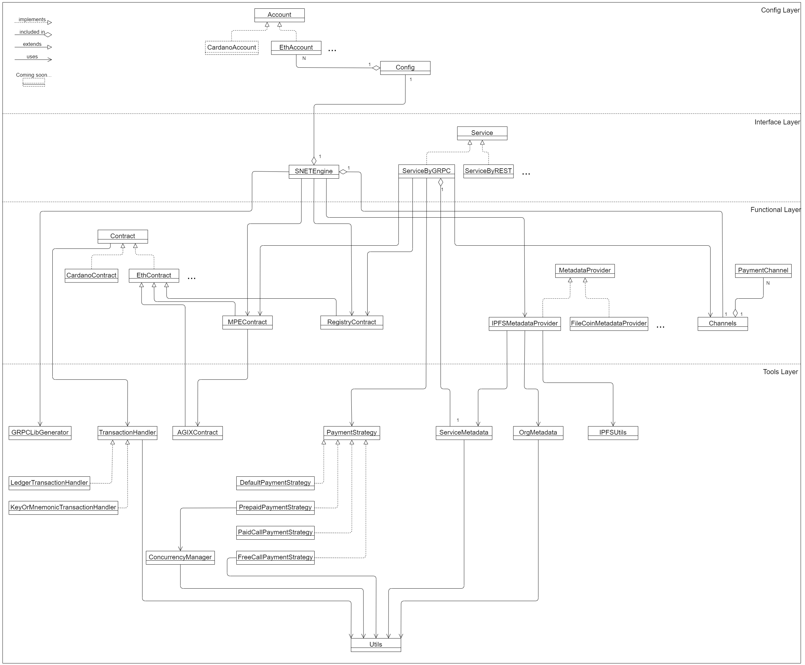
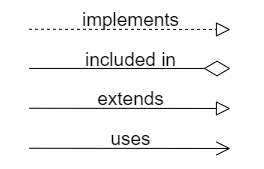

# SNET SDK protocol

SDK protocol describes the structure, entities and their functionality for the SDK 
regardless of the implementation language.

## Contents

- [SDK structure](#structure)
- [Entities description](#entities)
- [User story]()

## Structure

All entities can be divided into 4 layers:
1. `Config Layer` contains entities with many fields, that are needed to configure SDK.
2. At `Interface Layer` there are entities through which users have access to `Functional Layer`.
3. `Functional Layer` contains in its entities all the functionality of the SDK that users may need.
4. `Tools Layer` contains entities with various auxiliary functionality 
required for the operation of the functional level.

> There are 4 types of relationships in the diagram:\
> 

## Entities

- [Config Layer](#config-layer)
  1. [Account](#account)
  2. [EthAccount](#ethaccount)
  3. [Config](#config)
- [Interface Layer](#interface-layer)
  1. [SNETEngine](#snetengine)
  2. [Service](#service)
  3. [ServiceByGRPC](#servicebygrpc)
- [Functional Layer]()
  1. [Contract]()
  2. [EthContract]()
  3. [MPEContract]()
  4. [RegistryContract]()
  5. [MetadataProvider]()
  6. [IPFSMetadataProvider]()
  7. [PaymentChannel]()
  8. [Channels]()
- [Tools Layer]()
  1. [GRPCLibGenerator]()
  2. [AGIXContract]()
  3. [ServiceMetadata]()
  4. [OrgMetadata]()
  5. [IPFSUtils]()
  6. [TransactionHandler]()
  7. [LedgerTransactionHandler]()
  8. [KeyOrMnemonicTransactionHandler]()
  9. [PaymentStrategy]()
  10. [DefaultPaymentStrategy]()
  11. [FreeCallPaymentStrategy]()
  12. [PrepaidPaymentStrategy]()
  13. [PaidCallPaymentStrategy]()

---

### Config Layer

#### Account

`Account` is an abstract entity.

##### methods

- `get_name` - *abstract method* to get account name

---

#### EthAccount

`EthAccount` implements `Account`. It is needed to identify user wallet in the Ethereum blockchain.

##### fields

- `name` -  name of account
- `account_type` - type of user identification (private key, mnemonic phrase, ledger, etc.)
- `index` - index for mnemonic or ledger (optional)
- `address` - address of the wallet
- `private_key` - private key of the wallet
- `mnemonic` - mnemonic phrase of the wallet
- `nonce` - nonce of the wallet (amount of transactions)

##### methods

- _Constructor_ - takes _name_, _account_type_, _private_key_ (optional), _mnemonic_ (optional), _index_ (optional),
determines `address`, Sets `nonce` to 0
- `get_name` - returns `address`
- `get_nonce` - updates `nonce` by comparison with nonce value from we3 and increasing by 1

---

#### Config

`Config` is the main configuration entity containing all the data needed to work in the SNET platform.

##### fields

- `eth_rpc_endpoint` - blockchain entry point
- `concurrency` - switch on/off concurrency
- `network` - network name  (mainnet, sepolia, etc.)
- `blockchain` - blockchain name (ethereum, cardano, etc.)
- `force_update` - switch on/off forced update of pb files for grpc
- `accounts` - list (map) of `Account`'s
- `mpe_address` - address of MultyPartyEscrow smart contract
- `registry_address` - address of Registry smart contract
- `agix_address` - address of SingularityNetToken smart contract

##### methods

- _Constructor_ - takes all parameters with the same name as the fields except `accounts`
and _mpe_address_, _registry_address_, _agix_address_ are optional, assigns parameter values to fields
- `add_account` - takes `Account` or `EthAccount` and append it to `accounts`
- `get_account` - takes `name` of `Account` and returns `Account` by its name from `accounts`

---

### Interface Layer

#### SNETEngine

`SNETEngine` is the most important entity from the user side. The config is installed in it, 
and new accounts and services are created with its help. 
Moreover, most of the functions are accessible from `SNETEngine`.

##### fields

- `config` - `Config`'s instance 
- `w3` - an instance of the Web3 library class that allows working with the blockchain via Web3
- `agix` - `AGIXContract`'s instance
- `mpe` - `MPEContract`'s instance
- `registry` - `RegistryContract`'s instance
- `services` - list (map) of `Service`'s instances
- `metadata_provider` - `IPFSMetadataProvider`'s instance
- `channels` - `Channels`'s instance

##### methods

- _Constructor_ - takes `Config`'s instance and assign it to field `config`, 
initializes the remaining fields using the constructors of the corresponding entities
- `create_account` - takes _name_, _account_type_, _key_or_mnemonic_ (optional)
and _index_ (optional), creates `EthAccount`'s instance and appends it to `config`
- `create_service` - takes _org_id_, _service_id_, _group_name_ (optional), etc.,
creates `ServiceByGRPC`'s instance and returns it
- `mpe_contract` - returns `mpe`
- `agix_contract` - returns `agix`
- `registry` - returns `registry`
- `metadata_provider` - returns `metadata_provider`

---

#### Service

`Service` is an abstract entity.

##### methods

- `call` - calls service

---

#### ServiceByGRPC

